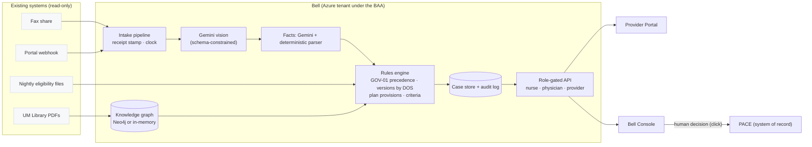

# Bell: prior authorization co-pilot for Bellcourt

Bell runs next to PACE. It reads every fax and portal request when it arrives and starts the regulatory clock at receipt. It tells the provider exactly what is missing. It gives nurses and physicians the rule that governs each case (plan document, then delegation addendum, then the policy version in effect on the date of service), with a citation they can click.

**Bell never denies, delays or modifies a request.** It recommends one of four actions: approve, request info, route to a physician, or eligibility hold. A qualified human makes every decision, and the server enforces that rule.

One web app, two entry points: **`/provider`** (the provider portal, with tabs for **Submit request** and **Voice agent**) and **`/dashboard`** (the clinical console). The demo script is in `../demo/DEMO.md`, and the demo faxes are in `../demo/`.

| Mode | Who | What they see |
|---|---|---|
| **Provider Portal**, Submit request | Requesting provider's office | Upload a fax (with a scanner animation), see each processing step live, get a receipt confirmation plus a cited list of missing items, reply, and track status without calling |
| **Provider Portal**, Voice agent | Provider's office, by voice | Call Bell (Gemini Live, real-time speech) and ask for a case update. Bell verifies the case number **and** the patient DOB through a server tool before disclosing anything. It cannot approve, deny or change a request. |
| **Bell Console**, Nurse | Anita Reyes, RN · Marcus Patel, RN | Queue sorted by deadline, the fax image, extracted fields (phone and MRN redacted), the GOV-01 rule path, plan provisions and criteria with citations. Can approve, request info or route to a physician. **Cannot deny**: the server returns 403. |
| **Bell Console**, Physician | Dr. Elena Vasquez (AZ, TX) · Dr. Samuel Okonjo (TN, GA) | Everything nurses see, plus the full unredacted record, extracted facts, letter draft and full audit inputs/outputs. Can approve or deny with a required rationale. **Arizona MA denials are blocked unless the physician holds an AZ licence.** |
| **Knowledge graph** | Console users | The UM Library as a graph. "Trace path" shows which rules apply to a client × service × date of service. |

## Quick start

```bash
cd bell-app
cp .env.example .env.local      # add GEMINI_API_KEY (optional; see below)
npm install
npm run dev                     # http://localhost:3000
```

On first load the Bell queue is seeded with the **30 open cases** from the data pack (13 are faxes). Receipt times are shifted so the newest case arrived 3 hours ago; the original timestamps are kept in each case's audit trail. **Reset demo** in the console reseeds the queue.

| Setting | Effect |
|---|---|
| `GEMINI_API_KEY` set | Uploaded faxes are read by Gemini vision (`GEMINI_MODEL`, default `gemini-2.5-flash`). Clinical facts come from Gemini and are cross-checked by the deterministic parser. |
| No key | Fax OCR uses hand-verified cached extractions for the 13 data-pack faxes; any other upload goes to manual keying. Facts come from the deterministic parser. **The demo always runs.** |
| `NEO4J_URI/USER/PASSWORD` set | Rule resolution runs as a Cypher query in Neo4j. Load it with `docker compose up -d neo4j && npm run seed:neo4j`. |
| No Neo4j | The same graph and traversal run in memory and give the same answer. |
| `GEMINI_LIVE_MODEL` | Voice model (default `gemini-3.8-live`). The browser gets a **single-use ephemeral token** with model, instructions and tools locked server-side; the API key never reaches the client. |

## Evidence it works

`npm run eval` runs the following checks; results are written to `data/runtime/eval.json`:

| Test set | Result | Baseline |
|---|---|---|
| **QA audit**: 120 cases with the auditor's correct decision | **120/120** decisions agree; **120/120** cite the auditor's governing source | Bellcourt reviewers: 56.7% |
| **Open queue**: 30 live cases (13 faxes), expected route per case | **30/30** routes; **6/6** expected safety flags | — |
| **Adversarial and malformed inputs**: injection text, a fake "pre-approved" claim, an empty fax, an unknown member, an unsupported service, a date of service with no policy version, silent notes, lapsed coverage | **8/8** flagged or routed to a human; none approved on an attacker's say-so | — |
| **OCR**: Gemini against 13 hand-keyed faxes (needs a key) | Field-level accuracy is printed | — |

Open-queue cases that are deliberate traps include: 8100 (void memo plus outdated PACE screen), 8106 and 8120 (instructions embedded in the fax), 8114 (Brightwater proton beam age exclusion), 8115 (bariatric surgery outside a Centre of Excellence), 8116 (Kestrel amendment), 8118 (Sorrel's stricter blepharoplasty rule), 8125 (age/DOB mismatch, investigational HBOT) and 8127 (lapsed coverage).

**Honest caveats:**
- The deterministic parser was built against the pack's templated notes, so 100% on the QA set measures rule selection and logic, not free-text understanding. Free text is the job of the Gemini path. Score it with a key and shadow it on live cases before go-live (gate 2 in the case document).
- Neo4j resolution is implemented, and `npm run seed:neo4j` checks it for parity against the in-memory resolver on 544 queries. It was not run in this environment because Docker was unavailable.

## Architecture



**Flow for each request:** receipt timestamp → read the document (OCR) → match the member to eligibility → resolve the governing rules from the graph → evaluate plan provisions and policy criteria (deterministic) → recommend → send an outreach message if anything is missing → a human decides → audit log.

## Compliance controls, mapped to their sources

| Requirement | Source | Where it's enforced |
|---|---|---|
| No automated denial, delay or modification | Riverbend addendum §5 | `Recommendation` type has no deny value. `authorize()` in `src/lib/access.ts`. Outreach does not pause the clock. |
| Nurses may approve but not deny | Addendum §4; SPD §5.5 | `authorize()` returns 403 and logs `ACTION_BLOCKED` |
| AZ-licensed medical director signs AZ MA denials | REG-02; addendum §4 | `authorize()` checks the persona's `licensedStates` |
| AI-use disclosure for Texas members | REG-02; addendum §4 | `buildLetter()` appends the disclosure |
| Inputs and outputs producible on audit | Addendum §5 | Every pipeline step writes `audit[]` with its data (physicians see the payloads) |
| Version in effect on the date of service; memos can't override policy | GOV-01 §1–2 | `resolveRules()` and memo `CONFLICTS_WITH` edges → VOID |
| Pend, never deny, when documentation is missing | Every MP §5 | A `null` fact → MISSING → `PEND_FOR_INFO` |
| PHI minimization | Security requirement | Nurse view redacts phone and MRN; providers see only their own cases; the KB graph holds no PHI; files are served by basename only |
| Untrusted provider content | README; Marcus Bell | Directive detector raises a critical flag; LLM output is schema-only; rules are code |

## Project layout

```
src/lib/kb/data.ts      KB transcribed from the UM Library (verbatim quotes → citations)
src/lib/kb/graph.ts     graph model + in-memory resolver
src/lib/kb/neo4j.ts     Neo4j seed + Cypher resolver (optional)
src/lib/engine.ts       rules engine → recommendation, rule path, criteria, letters
src/lib/facts.ts        deterministic facts parser + untrusted-instruction detector
src/lib/gemini.ts       Gemini adapters (fax fields, clinical facts)
src/lib/pipeline.ts     intake pipeline (streams steps to the UI), provider supplements, seeding
src/lib/access.ts       personas, role projection, action guardrails
src/app/provider        Provider Portal
src/app/dashboard            Bell Console (queue, case workspace, knowledge graph)
scripts/eval.ts         evidence: QA audit, open queue, adversarial, OCR
scripts/seed-neo4j.ts   Neo4j load + parity check
```

See `docs/DESIGN_NOTE.md` for the reasons behind the technology choices.
